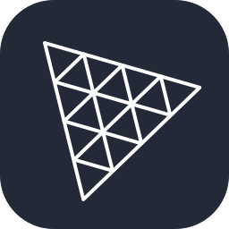

# Miguel Enrique Dasalla

A dynamic and immersive portfolio website showcasing my skills and projects, built with cutting-edge web technologies.  This site is designed to provide a seamless and engaging user experience across all devices.

## Built With

This portfolio leverages a modern tech stack to deliver a performant and visually stunning experience:

  
  
  
  
  
  
  
  
  
  
  
  

## Key Features

*   **Responsive Design:** Optimized for a seamless viewing experience across desktops, tablets, and mobile devices.
*   **Interactive 3D Elements:** Engaging 3D visuals powered by Three.js create a unique and memorable experience.
*   **Smooth Animations:** Framer Motion brings the portfolio to life with subtle yet impactful animations.
*   **Clean and Modern UI:** Material UI ensures a consistent and professional aesthetic.
*   **Performance and Scalability:** Built with React.js for optimal performance and maintainability.

## Acknowledgements

I would like to express my gratitude to the developers and maintainers of the following libraries and resources, which were instrumental in building this portfolio:

*   React.js: For providing the foundation for this project.
*   Three.js: For enabling the creation of interactive 3D elements.
*   Styled-Components: For facilitating a clean and organized styling approach.
*   Material UI: For providing a comprehensive set of UI components.
*   Framer Motion: For powering the smooth and engaging animations.

## License

