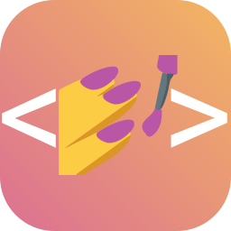

# Miguel Enrique Dasalla | Portfolio

## ✨ Overview

This portfolio is built with cutting-edge web technologies to create an immersive and engaging user experience. It features interactive 3D elements, smooth animations, and a responsive design that adapts seamlessly to any device.

## 🛠️ Tools and Technologies

|               |       **React**       | Component-based library for building interactive user interfaces |
| :------------------------------------------------------------------------------------------: | :-------------------: | :--------------------------------------------------------------: |
|             |    **JavaScript**     |          Core programming language for web development           |
|                 |       **HTML**        |         Standard markup language for creating web pages          |
|                   |        **CSS**        |     Style sheet language for designing website presentation      |
|           |    **Material UI**    |  React component library implementing Google's Material Design   |
|  | **Styled Components** |          CSS-in-JS library for component-based styling           |
|            |     **Three.js**      |    JavaScript library for creating 3D graphics in the browser    |
|      |   **Framer Motion**   |            Production-ready motion library for React             |
|            |      **VS Code**      |             Lightweight, powerful source code editor             |
|                   |        **Git**        |                Distributed version control system                |
|             |      **GitHub**       |    Platform for hosting and collaborating on Git repositories    |
|                   |        **NPM**        |                  Package manager for JavaScript                  |

## ✨ Features

| Category    | Feature               | Description                                                             |
| ----------- | --------------------- | ----------------------------------------------------------------------- |
| **Visuals** | Immersive 3D Elements | Interactive star field and Earth model powered by Three.js              |
|             | Fluid Animations      | Smooth transitions and motion effects using Framer Motion               |
| **Design**  | Responsive Layout     | Optimized viewing experience across desktop, tablet, and mobile devices |
|             | Modern UI/UX          | Clean, intuitive interface with Material UI components                  |
| **Content** | Project Showcase      | Highlighting key projects including Kopibara and UniLink                |
|             | Skills Visualization  | Dynamic display of technical skills and competencies                    |
|             | Experience Timeline   | Professional journey presented in an engaging format                    |

## 📱 Responsive Design

The portfolio adapts gracefully to different screen sizes:

- **Desktop** - Full immersive experience with 3D animations
- **Tablet** - Optimized layout preserving key visual elements
- **Mobile** - Streamlined interface for on-the-go viewing

## 🔧 Development

```bash
# Clone the repository
git clone https://github.com/akosikhada/akosikhada.github.io.git

# Install dependencies
npm install

# Start development server
npm start

# Build for production
npm run build
```

## 📄 License

This project is licensed under the MIT License - see the [LICENSE](LICENSE) file for details.

---
